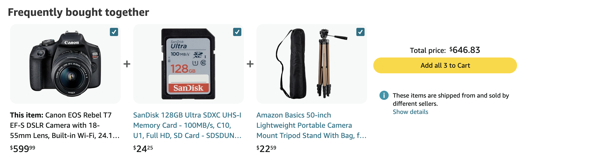
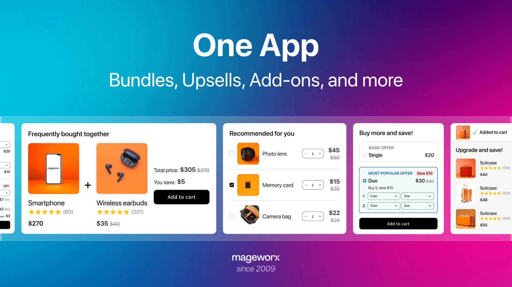
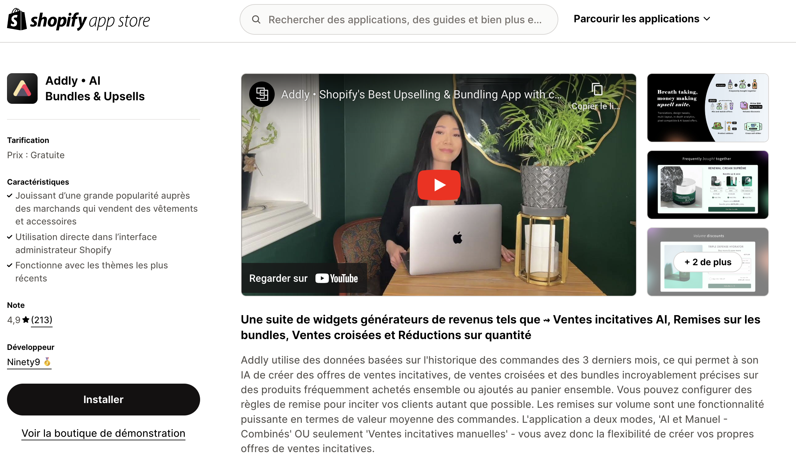
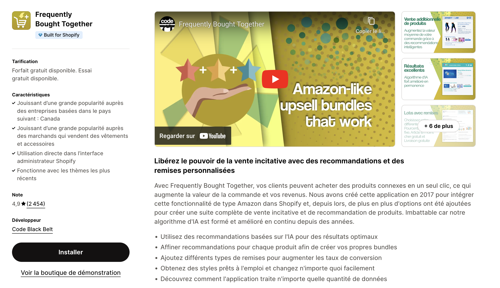
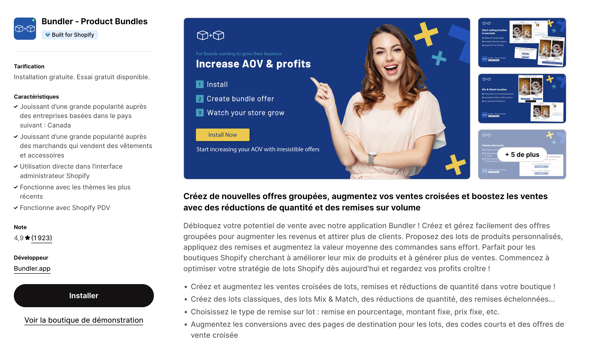
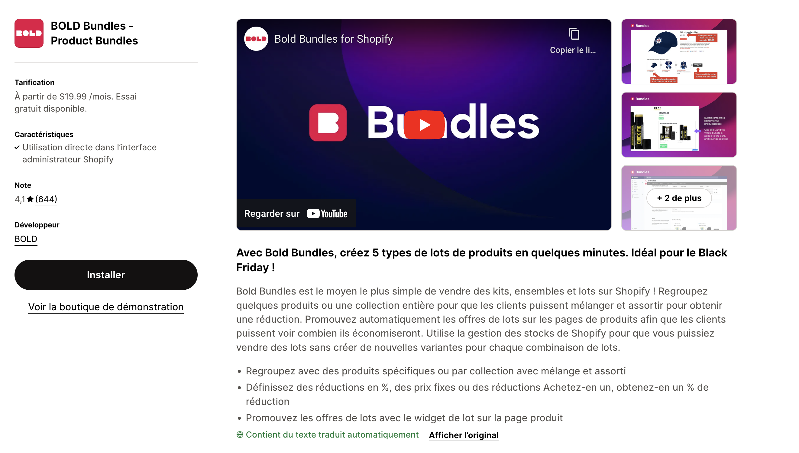

# Comment Créer des Bundles "Fréquemment Achetés Ensemble" comme sur Amazon mais sur ta boutique Shopify!

## Introduction

Imaginez une boutique Shopify qui propose des suggestions de produits comme Amazon : un casque avec des écouteurs, ou un téléphone avec sa coque et un chargeur. Ces bundles "Fréquemment achetés ensemble" sont de puissants leviers pour augmenter les ventes. Cet article vous guide pour mettre en place cette stratégie, à l'aide d'outils performants, en maximisant vos chances de succès.

## Pourquoi les bundles Amazon séduisent autant ?

Les bundles "Fréquemment achetés ensemble" sur Amazon sont devenus un standard grâce à leur efficacité à augmenter le panier moyen et à offrir une expérience utilisateur simplifiée.

### Exemples de bundles efficaces :

*Crédit : Amazon.*

### L'impact psychologique

Proposer des articles complémentaires incite à l'achat impulsif tout en simplifiant la décision pour vos clients. Résultat : une hausse des ventes et de la satisfaction client.

## Une interface intuitive pour vos bundles

Créer des bundles sur Shopify ne doit pas être compliqué. Certaines applications, comme MW Product Bundles, rendent cette tâche accessible à tous les commerçants, sans avoir besoin de connaissances techniques.

*Crédit : MW Product Bundles & Add‑ons.*

L'objectif est de maximiser vos ventes tout en rendant l'expérience fluide pour vos clients.

## Comment créer un bundle efficace ?

### Identifier les produits à regrouper

Pour concevoir un bundle performant, commencez par réfléchir aux produits qui se complètent naturellement. Quels articles sont indispensables ensemble ? Quels produits créent une expérience plus riche lorsqu'ils sont associés ? Par exemple, un appareil électronique avec ses accessoires ou un lot de produits saisonniers.

Les bundles les plus efficaces répondent à un besoin ou simplifient le choix pour le client, tout en augmentant la valeur perçue.

### Utiliser l'historique de vos commandes et l'intelligence artificielle

Analyser l'historique de vos commandes est une méthode essentielle pour identifier les produits fréquemment achetés ensemble. Mais ce processus peut être fastidieux. C'est ici qu'intervient Addly: Bundle Upsell, l'application qui révolutionne la création de bundles grâce à l'intelligence artificielle.

*Crédit : Addly • AI Bundles & Upsells.*

Addly analyse automatiquement les comportements d'achat de vos clients, identifie les combinaisons les plus pertinentes et vous propose des idées de bundles optimisés pour maximiser vos ventes. En quelques clics, vous pouvez mettre en place des offres attractives qui correspondent parfaitement aux attentes de votre clientèle.

## Avantages et inconvénients des bundles

### Avantages

- Augmentation du panier moyen : Encouragez vos clients à acheter plus.
- Satisfaction client : Simplifiez leur parcours d'achat.
- Écoulement des stocks : Associez des articles invendus à des best-sellers.

### Inconvénients

- Risque de cannibalisation : Les bundles peuvent réduire les marges si mal calibrés.
- Gestion des stocks : Un mauvais suivi peut entraîner des ruptures d'approvisionnement.

## Alternatives à l'application MW Product Bundles

### Si MW Product Bundles ne vous convient pas, voici d'autres options :

Frequently Bought Together : Idéal pour les suggestions automatiques basées sur les comportements d'achat.

*Crédit : Frequently Bought Together.*

Bundler - Product Bundles : Une solution gratuite pour les débutants avec des options de base.

*Crédit : Bundler - Product Bundles.*

Bold Bundles : Connu pour sa flexibilité et ses fonctionnalités avancées.

*Crédit : Bold Bundles.*

Comparez ces alternatives pour choisir celle qui correspond le mieux à vos besoins.

## Conclusion

Les bundles "Fréquemment achetés ensemble" sont une stratégie incontournable pour les boutiques Shopify cherchant à maximiser leurs ventes. Que vous optiez pour MW Product Bundles ou une alternative, l'essentiel est de proposer des offres pertinentes et attractives. Inspirez-vous d'Amazon et transformez vos visiteurs en clients fidèles grâce à une expérience d'achat optimisée.