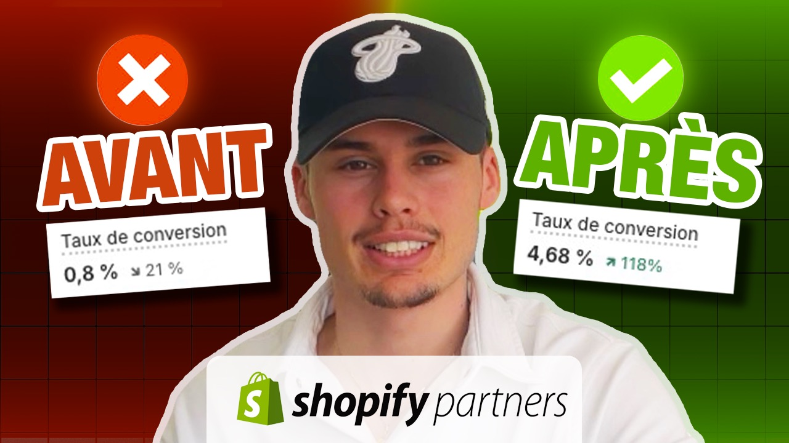

# Optimisez Votre Boutique en Ligne avec la Stratégie CRO : Une Approche Testée et Éprouvée

## Introduction

Bienvenue sur le blog de Lëc Média, où aujourd'hui nous plongeons dans le vaste univers du Conversion Rate Optimization (CRO). Notre dernier tutoriel vidéo, animé par Arthur Noellec, directeur de l'agence, décompose les stratégies essentielles pour transformer votre boutique en ligne en une machine à convertir les visiteurs en acheteurs.

## Stratégie Low Budget : Commencez Petit, Visez Grand

Notre vidéo commence par explorer la stratégie CRO 'low budget', idéale pour ceux qui débutent ou disposent de ressources limitées. Le point de départ ? Identifier les 'points de douleur' de votre site web. Utilisez des outils comme Hotjar ou Figpii pour analyser les interactions des visiteurs avec votre site :

**Heatmaps** - Ces cartes thermiques vous montrent où les gens cliquent le plus sur votre page, vous aidant à comprendre quelles zones attirent l'attention.

**Scroll Maps** - Ces cartes révèlent jusqu'où les visiteurs défilent sur vos pages, vous offrant un aperçu de leur patience et engagement.

En évaluant l'efficacité de différentes pages et en modifiant les zones à faible rétention, vous posez les bases d'une expérience utilisateur améliorée.

## L'Utilisation des Tests A/B

La vidéo aborde ensuite la puissance des tests A/B. Imaginez pouvoir montrer une version A de votre site à la moitié de vos utilisateurs et une version B à l'autre moitié. Ce type de test permet de mesurer directement l'impact de modifications mineures, comme un changement de couleur d'un bouton ou le texte d'un appel à l'action, et peut significativement augmenter la rétention.

## Résultats et Avantages à Long Terme

Après 2 à 4 semaines de ces tests initiaux, vous pourriez voir une augmentation significative de l'engagement et des conversions :

**Augmentation des ajouts au panier :** de 15 à 30%

**Amélioration des taux de conversion :** de 5 à 6%

## Au-delà de la Stratégie Low Budget

Arthur conclut en soulignant les limites de la stratégie low budget et l'avantage d'une refonte totale du site pour ceux qui peuvent se le permettre. Un nouveau design et une meilleure intégration du branding peuvent non seulement augmenter ces chiffres, mais aussi renforcer votre fondation pour moins de maintenance à long terme.

## Invitations et Ressources

Pour ceux qui souhaitent approfondir ou ont des questions, Arthur a inclus dans la description de la vidéo un lien vers son Calendly pour réserver un appel. Ne manquez pas également les ressources recommandées pour devenir un expert en CRO.

*Comment X4 le taux de conversion sur Shopify en 2024. Crédit: Arthur Noëllec*

**Pour découvrir plus de détails et visualiser nos conseils en action, [regardez la vidéo complète sur notre chaîne YouTube](https://youtu.be/iM7-RxupKvQ). Votre parcours vers une meilleure conversion commence ici !**

## Qui sommes nous ?

Chez LËC MÉDIA, nous sommes votre partenaire passionné pour le succès en ligne. Notre équipe d'experts en commerce électronique et de créatifs dévoués met tout en œuvre pour propulser votre entreprise vers de nouveaux sommets. Découvrez comment nous pouvons réaliser vos objectifs. Votre succès est notre priorité.

[En savoir plus](https://lec-media.agency/) | [Contactez nous](https://lec-media.agency/#contact)